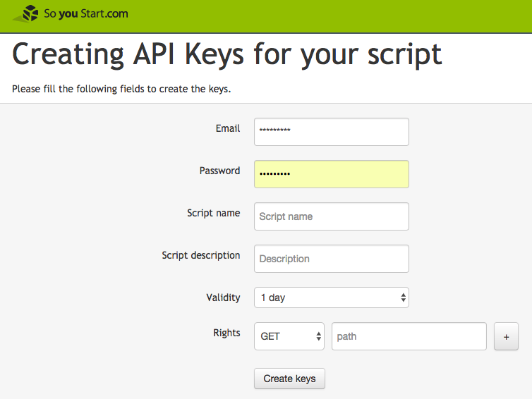

# Booting Zero-OS on OVH

Make sure you have an OVH account: https://eu.soyoustart.com/

Then create your OVH API keys on https://eu.api.soyoustart.com/createToken/:



Add theses rights:
```
GET: /*
POST: /*
PUT: /*
```

Copy the created keys in into the below scripts, replacing:
```python
- {Application Key}
- {Application Secret}
- {Consumer Key}
- {target}
```

The last value, `{target}` is actually the DNS name of your server, e.g. 'ns3588821.ip-176-31-252.eu'

In the first script you will also have to provide a value for `ztnetwork` and the `ztapitoken`, the later can be created on the Account page of your https://my.zerotier.com/.

Next, depending on whether you've JumpScale installed on your machine, you might prefer one of the two below options:
- [Using JumpScale](#using-jumpscale)
- [Using a plain Python script](#using-a-plain-python-script)

## Using JumpScale

```python
appkey = "{Application Key}"
appsecret = "{Application Secret}"
consumerkey = "{Consumer Key}"
branch = "{Zero-OS Branch}"
ztnetwork = "{ZeroTier Network ID}"
ztapitoken="{ZeroTier API access token}"

cl = j.clients.ovh.get(appkey, appsecret, consumerkey)

serverid = j.tools.console.askChoice(cl.serversGetList(), "Select server to boot Zero-OS, be careful!")

pxescript = "https://bootstrap.gig.tech/ipxe/{0}/{1}".format(branch, ztnetwork)

task = cl.zeroOSBoot(serverid, pxescript)

cl.waitServerReboot(serverid, task['taskId'])
```

Check the result in the OVH Dashboard: https://eu.soyoustart.com/manager

At this point you will now need to go to `https://my.zerotier.com/network/{ZeroTier Network ID}` in order to authorize the join request.

Let's continue to get the ZeroTier network address via JumpScale, using the Zero-Tier client:

```python
ip_pub = cl.serverGetDetail(serverid)["ip"]
zt = j.clients.zerotier.get(token=ztapitoken)
member = zt.getNetworkMemberFromIPPub(ip_pub, networkId=ztnetwork, online=True)
ipaddr_priv = member["ipaddr_priv"][0]
```

## Using a plain Python script

Copy the below script to a new file `ovh-deploy.py`, and search and replace the strings as described above:
```python
import requests
import sys
import ovh

class ZeroOS_Ovh():
    def __init__(self, appkey, appsecret, consumerkey):
        self.client = ovh.Client(
            endpoint='soyoustart-eu',
            application_key=appkey,
            application_secret=appsecret,
            consumer_key=consumerkey,
        )

        self.scriptId = -1

    def clientStatus(self):
        print(self.client.get("/auth/currentCredential"))
        print(self.client.get("/me/api/application"))
        print(self.client.get("/me/api/credential"))
        return True

    def listNetworkBootloader(self):
        return self.client.get("/me/ipxeScript")

    def inspectNetworkBootloader(self, name):
        return self.client.delete("/me/ipxeScript/%s" % name)

    def deleteNetworkBootloader(self, name):
        return self.client.delete("/me/ipxeScript/%s" % name)

    def installNetworkBootloader(self, ipxe):
        return self.client.post("/me/ipxeScript", **ipxe)

    def isAvailable(self, name):
        existing = self.listNetworkBootloader()

        for item in existing:
            if item == name:
                return True

        return None

    def _setBootloader(self, target, bootid):
        print("[+] bootloader selected: %s" % bootid)

        payload = {"bootId": int(bootid)}
        self.client.put("/dedicated/server/%s" % target, **payload)

        return True

    def setBootloader(self, target, name):
        bootlist = self.client.get("/dedicated/server/%s/boot?bootType=ipxeCustomerScript" % target)
        checked = None

        for bootid in bootlist:
            data = self.client.get("/dedicated/server/%s/boot/%s" % (target, bootid))
            if data['kernel'] == name:
                return self._setBootloader(target, bootid)

        return False

    def reboot(self, target):
        return self.client.post("/dedicated/server/%s/reboot" % target)

    #
    # custom builder
    #
    def build(self, url):
        # strip trailing flash
        url = url.rstrip('/')

        # downloading original ipxe script
        script = requests.get(url)
        if script.status_code != 200:
            raise RuntimeError("Invalid script URL")

        # going unsecure, because ovh
        fixed = script.text.replace('https://bootstrap.', 'http://unsecure.bootstrap.')

        # setting name and description according to the url
        fields = url.split('/')

        if len(fields) == 7:
            # branch name, zerotier network, arguments
            description = "Zero-OS: %s (%s, %s)" % (fields[4], fields[5], fields[6])
            name = "zero-os-%s-%s,%s" % (fields[4], fields[5], fields[6])

        elif len(fields) == 6:
            # branch name, zerotier network, no arguments
            description = "Zero-OS: %s (%s, no arguments)" % (fields[4], fields[5])
            name = "zero-os-%s-%s" % (fields[4], fields[5])

        else:
            # branch name, no zerotier, no arguments
            description = "Zero-OS: %s (no zerotier, no arguments)" % fields[4]
            name = "zero-os-%s" % fields[4]

        return {'description': description, 'name': name, 'script': fixed}

    def configure(self, target, url):
        ipxe = self.build(url)

        print("[+] description: %s" % ipxe['description'])
        print("[+] boot loader: %s" % ipxe['name'])

        if not self.isAvailable(ipxe['name']):
            print("[+] installing the bootloader")
            self.installNetworkBootloader(ipxe)

        zos.setBootloader(target, ipxe['name'])


if __name__ == '__main__':
    target = "{target}"

    print("[+] initializing client")
    zos = ZeroOS_Ovh('{Application Key}', '{Application Secret}', '{Consumer Key}')

    print("[+] setting up machine: %s" % target)
    zos.configure(target, "https://bootstrap.gig.tech/ipxe/master/17d709436c7366d8/debug")

    print("[+] rebooting the server")
    zos.reboot(target)
```

Execute the script:
```bash
python3 ovh-deploy.sh
```
