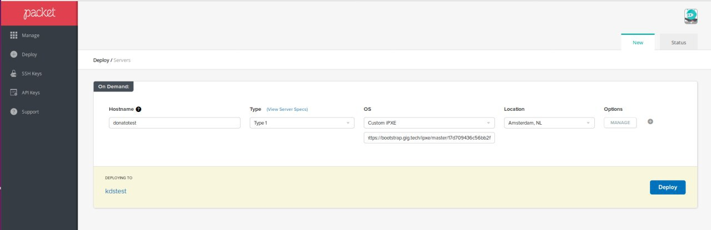
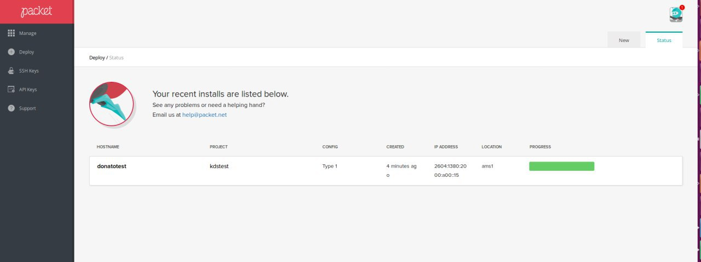

# Booting Zero-OS on Packet.net
For that section you need to have an account on **Packet.net** or an invitation to join.

Click on the following link and Sign Up ==>> https://www.packet.net

1. Once you are in, go to the left side bar and select **Deploy**.

2. Select a project on the drop-down menu, then select *Servers* and click on **Proceed**.

    

3. Fill the following information:
  * **Hostname**: *Type a Hostname.*
  * **Type**: Type 1
  * **OS**: Custom iPXE
  * **iPXE URL**: https://bootstrap.gig.tech/ipxe/master/ {your_ZeroTier_network_ID}
  * **Location**: *Choose the closest one to you.*

  After that, press on **Deploy** and wait till the process is finished.

    

****NOTE**: If you want to see all the details about your machine, just click on **Manage** on the left side bar and select your hostname.
