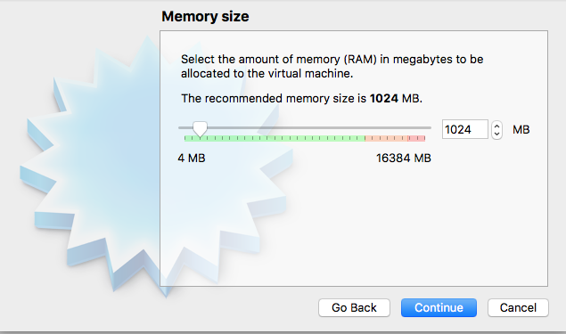
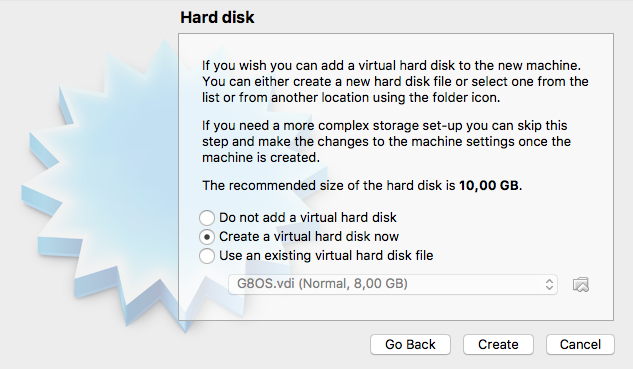
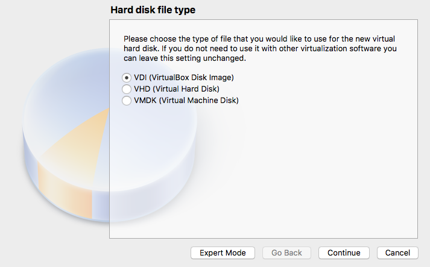
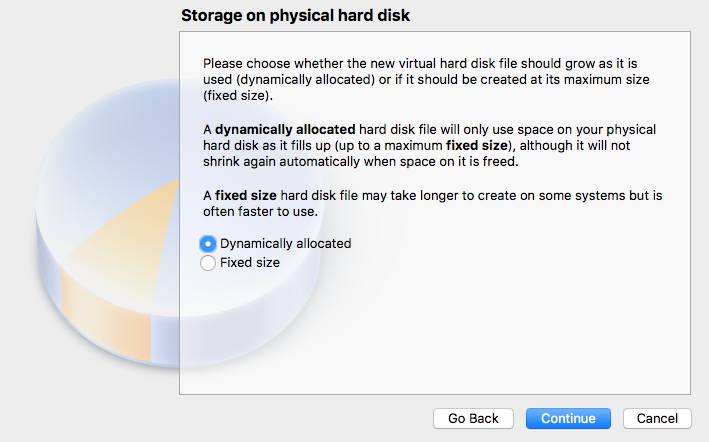
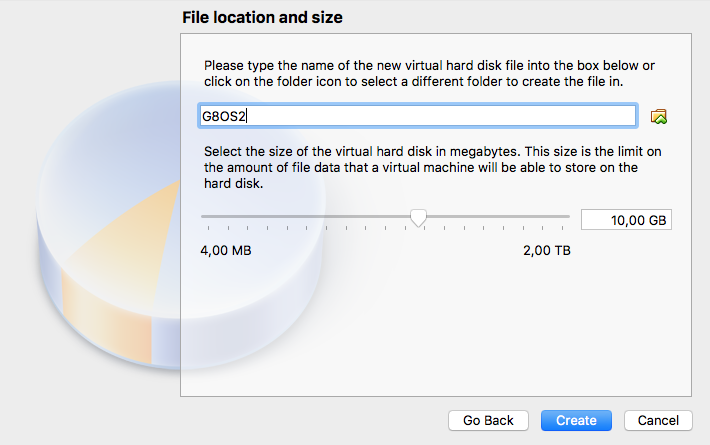
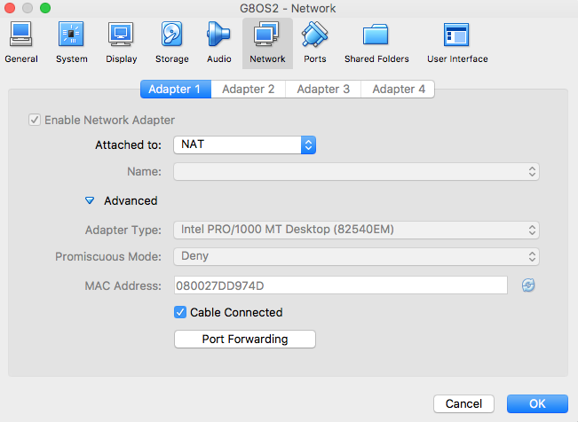
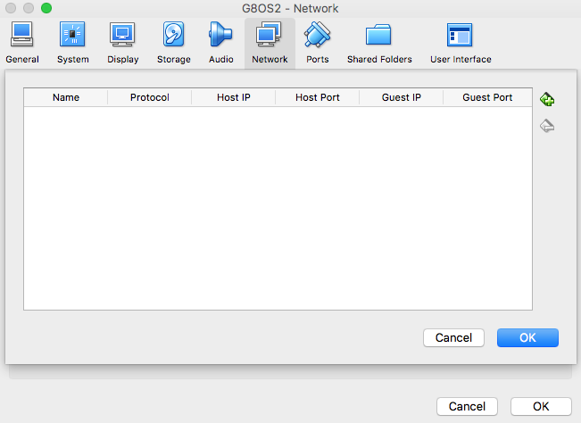
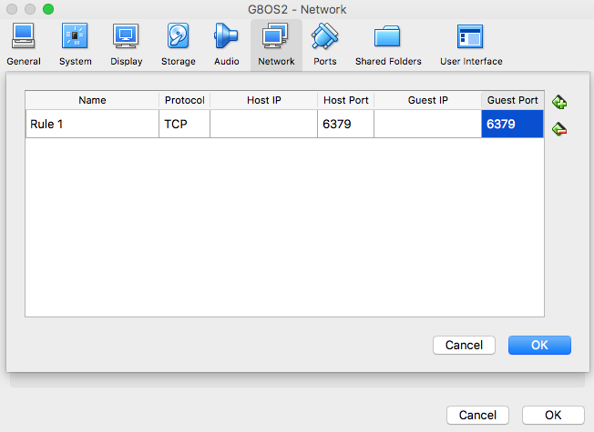
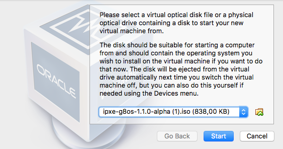

# Booting Zero-OS on VirtualBox

The easiest and recommended approach is to boot from an ISO image you get from the [Zero-OS Bootstrap Service](https://bootstrap.gig.tech/). You get an ISO boot image using `https://bootstrap.gig.tech/iso/{BRANCH}/{ZEROTIER-NETWORK}` where:

- **{BRANCH}** is the branch of the CoreOS, e.g. `1.1.0-alpha`, or `zero-os-master`
- **{ZEROTIER-NETWORK}** is the ZeroTier network ID, create one on https://my.zerotier.com/network

See the [ISO section in the Zero-OS Bootstrap Service documentation](../bootstrap/README.md#iso) for more details on this.

Alternatively you can build your own boot image and create your own boot disk as documented in [Building your Zero-OS Boot Image](../building/README.md).

Once you got your boot image, continue following the next steps:

- [Create a new virtual machine on VirtualBox](#create-vm)
- [Create a port forward for the virtual machine in order to expose the Redis of the Zero-OS](#create-portforward)
- [Start the virtual machine](#start-vm)
- [Ping the Zero-OS](#ping)


<a id="create-vm"></a>
## Create a new virtual machine on VirtualBox  

Specify a name for your new virtual machine, select **Linux** as type, and **Ubuntu (64-bit)** as version:  

  

Accept the default settings for memory size:

  

Also accept the default settings for creating a virtual disk:

  

  






<a id="create-portforward"></a>
## Create a port forward for the virtual machine in order to expose the Redis of the Zero-OS (optional)

This step is optional since you are probably using an Zero-OS connected to Zero-Tier network.

In the **Settings** of the virtual machine expand the **Advanced** section on the **Network** tab:



Click the **Port Forwarding** button:



Forward port 6379:




<a id="start-vm"></a>
## Start the VM

When starting the virtual machine you will be asked to select the ISO boot disk.

Here you have two options:
- Create one yourself, as documented in [Create a Bootable Zero-OS ISO File](iso.md)
- Or get one from the [Zero-OS Bootstrap Service](https://bootstrap.gig.tech/)



<a id="ping"></a>
## Ping the Zero-OS

A basic test to check if your Zero-OS instance is functional, is using the `redis-cli` Redis command line tool:
```
ZEROTIER_NETWORK="..."
REDIS_PORT="6379"
redis-cli -h $ZEROTIER_NETWORK -p $REDIS_PORT ping
```

See [Interacting with Zero-OS](../interacting/README.md) for more examples on how to interact with Zero-OS.
