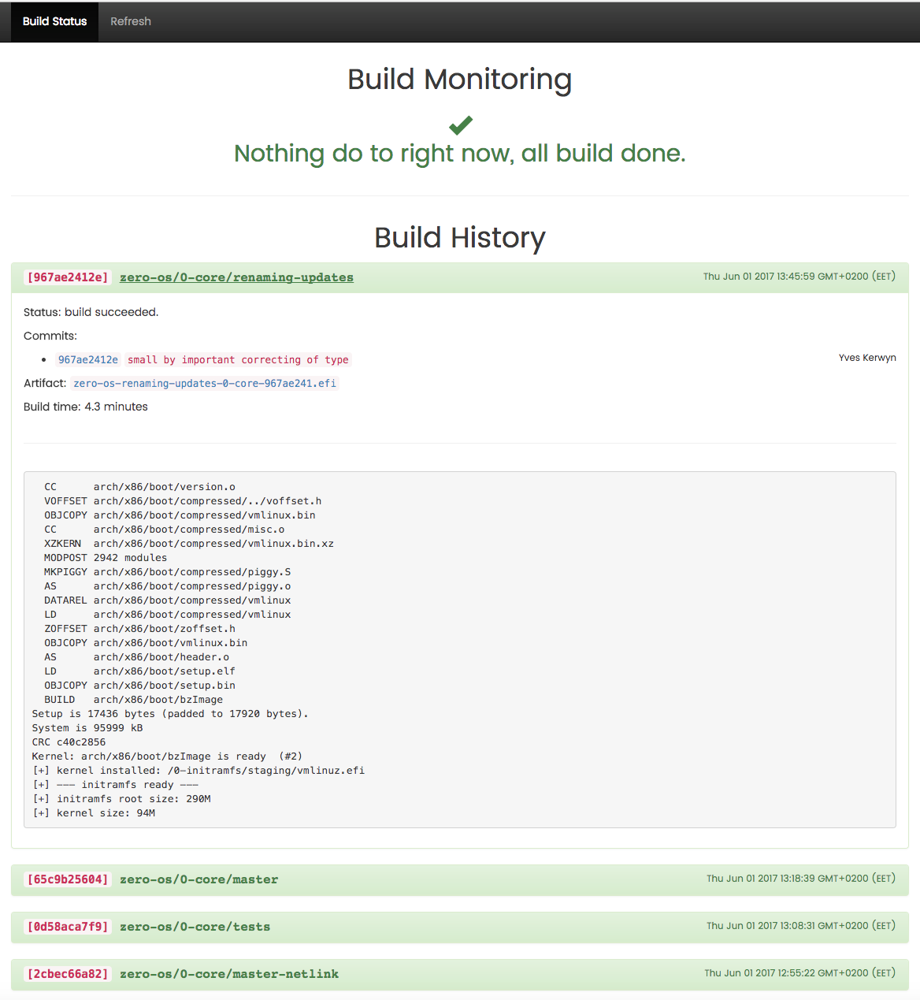
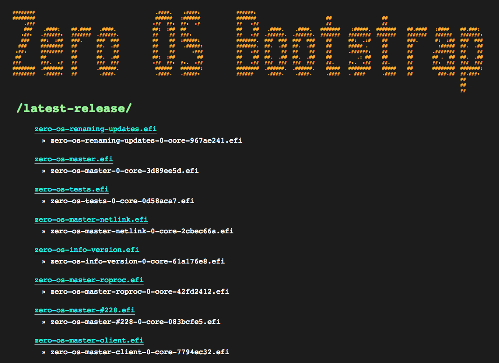

# Building your Zero-OS Kernel

Building is done using the `initramfs.sh` script available from https://github.com/zero-os/0-initramfs

Below we discuss:

- [Dependencies](#dependencies)
- [Privileges](#privileges)
- [Building using a Docker container](#docker)
- [What initramfs.sh does?](#whatitdoes)
- [How to use it?](#howtouse)
- [Custom build](#custom)
- [Autobuild](#autobuild)
- [Bootstrap Service](#bootstrap)
- [I have the kernel, what can I do with it?](#whatnext)


<a id="dependencies"></a>
## Dependencies

On Ubuntu 16.04, you need the following in order to compile everything:

 - `golang` (version 1.8)
 - `xz-utils pkg-config lbzip2 make curl libtool gettext m4 autoconf uuid-dev libncurses5-dev libreadline-dev bc e2fslibs-dev uuid-dev libattr1-dev zlib1g-dev libacl1-dev e2fslibs-dev libblkid-dev liblzo2-dev git asciidoc xmlto libbison-dev flex libmnl-dev libglib2.0-dev libfuse-dev libxml2-dev libdevmapper-dev libpciaccess-dev libnl-3-dev libnl-route-3-dev libyajl-dev dnsmasq`

These dependencies are of course valid for any other system but you'll have to adapt it to suit yours.

On Gentoo, you probably already have all the dependancies.


<a id="privileges"></a>
## Privileges

You need to have root privilege to be able to execute all the scripts.
Some parts need to chown/setuid/chmod files as root.


<a id="docker"></a>
## Building using a Docker container

First clone the [zero-os/0-initramfs](https://github.com/zero-os/0-initramfs) repository:
```shell
git clone git@github.com:zero-os/0-initramfs.git
```

From the root of this repository, create a Docker container:
```shell
docker run -v $(pwd):/initramfs -ti ubuntu:16.04 /bin/bash
```

Then from inside the Docker container, first install the dependencies:
```shell
apt-get update
apt-get install -y asciidoc xmlto --no-install-recommends
apt-get install -y xz-utils pkg-config lbzip2 make curl libtool gettext m4 autoconf uuid-dev libncurses5-dev libreadline-dev bc e2fslibs-dev uuid-dev libattr1-dev zlib1g-dev libacl1-dev e2fslibs-dev libblkid-dev liblzo2-dev git libbison-dev flex libmnl-dev xtables-addons-source libglib2.0-dev libfuse-dev libxml2-dev libdevmapper-dev libpciaccess-dev libnl-3-dev libnl-route-3-dev libyajl-dev dnsmasq liblz4-dev libsnappy-dev libbz2-dev libssl-dev gperf libelf-dev libkmod-dev liblzma-dev git kmod libvirt-dev
```

Then install Go:
```shell
curl https://storage.googleapis.com/golang/go1.8.linux-amd64.tar.gz > go1.8.linux-amd64.tar.gz
tar -C /usr/local -xzf go1.8.linux-amd64.tar.gz
export PATH=$PATH:/usr/local/go/bin
mkdir /gopath
export GOPATH=/gopath
```

<a id="whatitdoes"></a>
## What initramfs.sh does?

 - First, it downloads and checks the checksum of all needed archives
 - Extracts the archives
 - Compiles:
    - Busybox
    - Fuse (library and userland tools)
    - OpenSSL and SSL Certificates (CA-certificates)
    - util-linux (for `lsblk`, ...)
    - Redis (only the server is used)
    - Btrfs (`btrfs-progs`)
    - libvirt and QEMU
    - ZeroTier One
    - parted (partition management)
    - dnsmasq (used for DHCP on containers)
    - nftables (used for firewalling and routing)
    - iproute2 (used for network namespace support)
    - socat (used for some TCP port forwarding)
 - Cleans and removes useless files
 - Compiles the kernel and bundles `initramfs` into the kernel


<a id="howtouse"></a>
## How to use it?

Easy, just type:
```shell
cd /initramfs
bash initramfs.sh
```

The result of the build will be located in `staging/vmlinuz.efi`.

The `initramfs.sh` script accepts multiple options:

```shell
 -d --download    only download and extract archives
 -b --busybox     only (re)build busybox
 -t --tools       only (re)build tools (ssl, fuse, ...)
 -c --cores       only (re)build 0-core and coreX
 -k --kernel      only (re)build kernel (produce final image)
 -h --help        display this help message
```

The option `--kernel` is useful if you change something on the root directory and you want to rebuild the kernel (with the initramfs).

If you are modifying 0-core/coreX, you can simply use the `--cores --kernel` options and first the cores will be rebuilt and then `initramfs`. This will produce a new Zero-OS kernel with the latest changes.


<a id="custom"></a>
## Customize build

In order to customize you need to add a configuration file for a new service or update the configuration files of one of existing services in the `conf/root/` directory.

For example, you might want to join a private ZeroTier network during boot instead of joining (by default) the ZeroTier Earth network. This is achieved by updating the `conf/root/zerotier-public.toml` file:

```toml
## Joining a network
[startup."join-network"]
name = "zerotier.join"
after = ["zerotier"]

[startup."join-network".args]
network = "8056c2e21c000001"
```

See [Startup Services](../config/startup.md) in order to understand how to configure the startup services.

For all customization options see [Configuration](../config/README.md).


<a id="autobuild"></a>
## Autobuild

Every time a change is pushed to [zero-os/0-core](../../README.md), or [zero-os/0-fs](https://github.com/zero-os/0-fs), a pre-compiled initramfs image (called `baseimage`) will be used.
Building of 0-core or 0-fs only takes about 3 minutes.
If you push to [zero-os/0-initramfs](https://github.com/zero-os/0-initramfs), a complete kernel will be rebuilt, which can take from 20 minutes and up to 1 hour.

The build process can be monitored here: https://build.gig.tech/monitor/.



See [zero-os/0-autobuilder](https://github.com/zero-os/0-autobuilder) repository for more details.


<a id="bootstrap"></a>
## Bootstrap Service

All automated builds are made available on the Zero-OS Bootstrap Service: https://bootstrap.gig.tech



See the [zero-os/0-bootstrap](https://github.com/zero-os/0-bootstrap) repository for more details.


<a id="whatnext"></a>
## I have the kernel, what can I do with it?

Just boot it. The Zero-OS kernel is EFI bootable.

If you have an EFI shell, just run the kernel like any EFI executable.

If you don't have the shell or want to boot it automatically, save the kernel in `/EFI/BOOT/BOOTX64.EFI` in a FAT partition.

See [Create a Bootable Zero-OS ISO File](booting/iso.md) and [Booting Zero-OS](../booting/README.md) for all other options.
