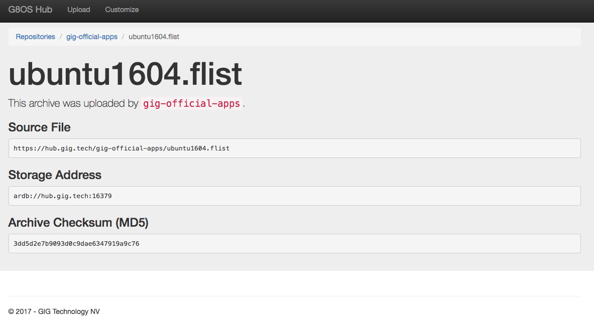

# Creating Containers

Also see the tutorial about this topic: [Create a Flist and Start a Container](https://github.com/zero-os/home/blob/master/docs/tutorials/Create_a_Flist_and_Start_a_Container.md)

Pre-requirements:

- Make sure you have a working Zero-OS instance running
- Make sure you can create a Python client instance and you can reach the Zero-OS

In the below example a very basic container is created that only mounts the root file system.

We use the [ubuntu1604.flist](https://hub.gig.tech/gig-official-apps/ubuntu1604.flist.md) flist from the [gig-official-apps repository on the Zero-OS Hub](https://hub.gig.tech/gig-official-apps):



Here's the Python script using the Zero-OS client:

```python
from zeroos.core0.client import Client
cl = Client("IP OF Zero-OS")

flist = 'https://hub.gig.tech/gig-official-apps/ubuntu1604.flist'

container_id = cl.container.create(flist, storage='ardb://hub.gig.tech:16379')
container = cl.container.client(container_id)

print(container.system('ls -l /opt').get())
```

> In the above example we explicitly specified with the `storage` argument that we want to mount the ARDB storage cluster of the Zero-OS Hub. When omitting this optional argument the default storage cluster of the Zero-OS node will be used. This default is set with the `fuse_storage` global parameter as documented in [Main Configuration](../config/main.md).

See [CoreX Commands](../interacting/commands/corex.md) for all available commands for managing containers.
