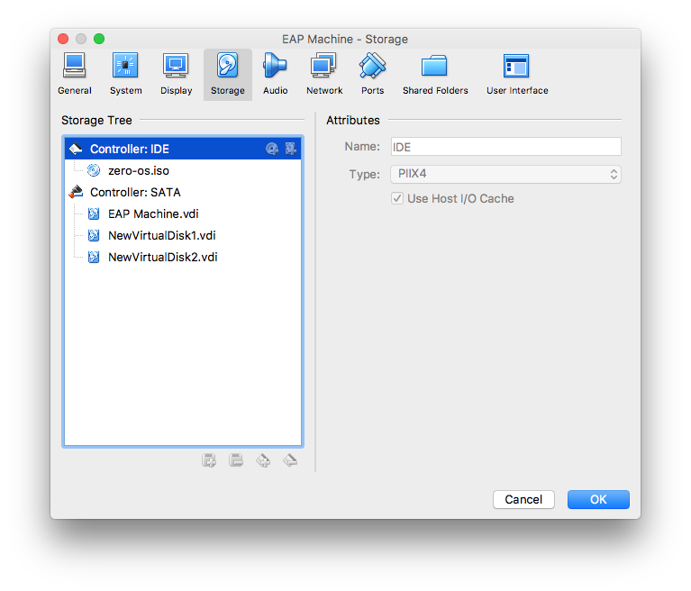

# Creating a RAID 0 Storage Pool

Below example requires a (virtual) machine with 3 disks, 1 boot disk and two additional disks that we'll pool together using RAID 0. RAID 0 spreads or “stripes” data between two or more drives. RAID 0 combines the drives into a single larger logical drive with a capacity that is the sum of all the drives in the array.

In VirtualBox you can easily add two virtual disks to a virtual machine running:




Here's how you create a RAID 0 storage pool using `sdb` and `sdc` and mount the storage pool under `/mydir`:

```python
from zeroos.core0.client import Client
cl = Client("192.168.196.73")
cl.filesystem.list("/")
disk_name1 = cl.disk.list()['blockdevices'][1]['name']
disk_name2 = cl.disk.list()['blockdevices'][2]['name']
device_name1 = "/dev/{}".format(disk_name1)
device_name2 = "/dev/{}".format(disk_name2)
devices = [device_name1, device_name2]
cl.btrfs.create('mydata', devices, 'raid0', 'raid0')
cl.filesystem.mkdir("/mydir")
cl.disk.mount(device_name1, '/mydir')
cl.filesystem.mkdir("/mydir/test")
cl.filesystem.list("/mydir")
cl.system("df -h").get()
cl.filesystem.upload_file("/mydir/myfile", "myfile")
```

The last command will upload a file `myfile` from your machine to the storage pool.
